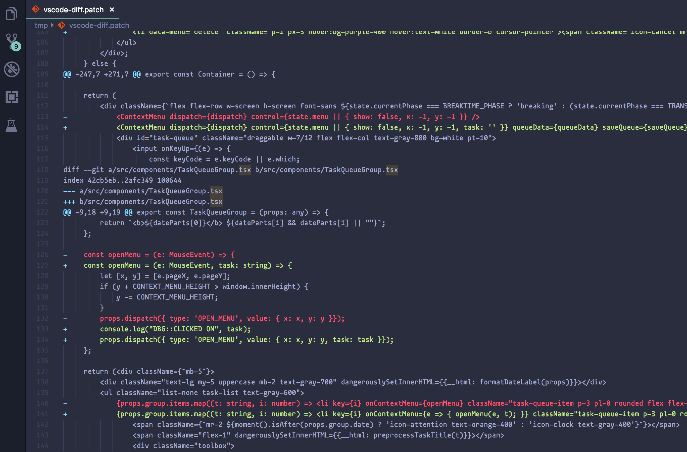

# vscode-diff

This is the extension to help you see all unstaged git diff of the current project in one buffer.

Just like when you run `git diff` in the Terminal, or using Magit in Emacs.

Using this extension, you just need to run: `View All Diff In One Buffer`